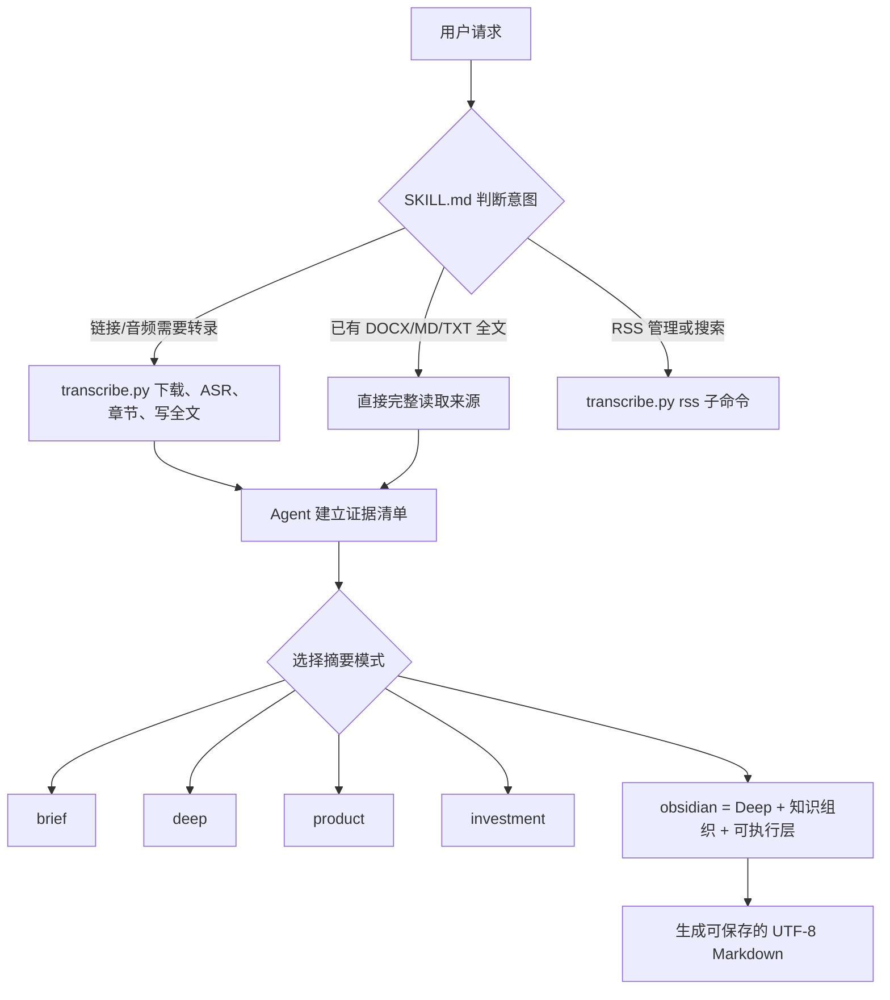

# podcast-bridge 是怎么运行的

这份说明写给要理解和继续修改 Skill 的人。最重要的认知是：`podcast-bridge` 不是一个“按下按钮就自动完成全部工作的单一程序”，而是两个部分协作。

## 一句话模型

```text
SKILL.md 负责判断该做什么
transcribe.py 负责确定性执行
当前 Agent 负责读全文并写摘要/笔记
```

## 三层结构

### 1. Agent 路由层

这一层决定工作流和输出标准，不直接做音频转录。

| 文件 | 作用 |
|---|---|
| `SKILL.md` | 总路由：识别用户意图、选择转录/RSS/搜索/摘要流程。 |
| `references/transcription.md` | 如何检查环境、转录直接链接或 RSS 单集。 |
| `references/summarization.md` | 所有摘要模式共用的证据规则和模式选择。 |
| `references/obsidian-deep.md` | 本地定制的 Deep+Obsidian 模板与质量门槛。 |
| `references/local-library-workflow.md` | 人工 SOP 的批量执行流程：扫描、选择、中文可读化、镜像保存、跳过已完成。 |
| `references/obsidian-native-style.md` | Obsidian 原生 Markdown、精简 YAML 和低 token 约束。 |
| `references/rss-workflows.md` | 订阅、同步、浏览、搜索和选择单集。 |
| `references/troubleshooting.md` | ASR、RSS、编码和运行时错误处理。 |
| `references/project-layout.md` | 文件位置和路径约束。 |

### 2. 确定性执行层

`transcribe.py` 是真正运行的 Python 程序，负责：

- 解析单集页面或 RSS。
- 下载和转码音频。
- 调用 Bcut 或 JianYing ASR。
- 对长音频切片、去重、合并时间戳。
- 自动生成章节。
- 写出 Markdown 全文稿。
- 管理 SQLite 播客库、订阅、搜索和转录状态。

它不负责稳定生成摘要。`--summary obsidian` 等参数只是把用户期望记录为模式提示；最终摘要由 Agent 读完全文后生成。

### 3. 数据与状态层

| 文件/目录 | 保存什么 |
|---|---|
| `config.json` | ASR、切片、输出和本地库配置。 |
| `subscriptions.json` | 当前激活的 RSS 订阅列表。 |
| `podcast-bridge-feeds/feeds/*.json` | 可选的内置播客目录。 |
| `podcast_library/library.sqlite3` | 已同步单集元数据和全文检索状态。 |
| `podcast_library/transcripts/` | 已转录的 Markdown 全文稿。 |
| `library-workflow.json` | 用户本地 DOCX 源目录、Obsidian 目标目录和批次配置。 |

## 一次请求的完整路径



## 五种摘要模式的关系

- `brief`：最小快速理解层。
- `deep`：在 brief 上补足主线、概念、案例、数字、问题和证据边界。
- `product`：以产品/运营问题重新组织证据。
- `investment`：以行业、商业模式、风险和信号重新组织证据。
- `obsidian`：本地已定制为 Deep 内容基线，再增加 YAML、双链、图表、指标、行动、原子笔记和明确标注的 Agent 思考。

因此，Obsidian 现在不是 Deep 的竞争模式，而是 Deep 的上层包装和应用增强。

## 人工 SOP 如何进入系统

人工 SOP 不适合全部塞进 `SKILL.md`。现在拆成三部分：

1. **Skill 规则**：什么请求触发、什么质量不能丢、默认不生成 HTML。
2. **Workflow**：用 `local-library-workflow.md` 管理逐篇处理、目录映射和完成判断。
3. **显示层**：默认交给用户现有的 Obsidian 主题；Skill 只输出原生 Markdown，不添加自定义 `cssclasses`。

确定性的队列状态由 `scan_transcript_queue.py` 读取真实文件计算，不依赖 SOP 中会过期的固定数量。

## 当前本地输出契约

当前采用三遍法：

1. **证据清单**：先抓主张、框架、数字、案例、引语和不确定性。
2. **Deep 基线**：先保证忠实、完整和可核查。
3. **Obsidian/运营层**：再加 YAML、双链、图表、指标、行动实验和独立的“我的思考”。

本地 V03 结构还要求：

- 成品镜像保存到 `raw/02-papers`。
- YAML 不生成 `source_type`、`language`、`status`、`human_sop` 或 `cssclasses`。
- 来源、节目、嘉宾、时长等元数据只保留在 YAML，正文不重复生成“基本信息”。
- 不执行额外美化，直接使用用户现有的 Obsidian 主题。
- 每次本地文稿执行完成后，把运行结果、困难、临时假设和规则升级状态写回《迭代记录》；未经人工确认，不把观察直接升级为稳定规则。

## 以后最常修改哪些文件

| 想改变什么 | 修改位置 |
|---|---|
| 什么请求会触发这个 Skill | `SKILL.md` 的 YAML `description` 和路由表。 |
| 五种摘要模式如何选择 | `references/summarization.md`。 |
| Obsidian 笔记栏目、深度、图表和行动层 | `references/obsidian-deep.md`。 |
| 本地 300+ 文稿如何逐篇处理 | `references/local-library-workflow.md` 与 `library-workflow.json`。 |
| Markdown 显示、YAML 精简和默认不美化 | `references/obsidian-native-style.md`。 |
| ASR、切片、章节或 RSS 程序行为 | `transcribe.py` 与相应运行参考。 |
| 默认时长、并发、输出目录 | `config.json`。 |
| 订阅源和推荐目录 | `subscriptions.json` 与 `podcast-bridge-feeds/feeds/`。 |

## 安全修改原则

- 只改变笔记结构时，不要改 `transcribe.py`。
- 不要把 Agent 推理写成嘉宾原话或已证实事实。
- 不要为了笔记“好看”丢掉关键案例、数字和反例。
- 不要默认添加 `podcast-zine`、主题类或正文“基本信息”。
- 新栏目最好先判断是否适合当前内容，不要所有笔记强制套同一张表。
- 修改引用文件名后，要同步更新 `SKILL.md` 和 `project-layout.md`。
- `subscriptions.json`、SQLite 和 transcripts 是本地运行状态，重新安装或升级时不要无意覆盖。
