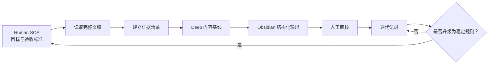

# Obsidian Transcript Workflow

一套把播客、访谈或博客 DOCX/Markdown/TXT 全文稿整理成高质量 Obsidian 中文笔记的可迭代工作流。

这个仓库不是单独的一条大 Prompt，而是把任务拆成三层：

1. **Human SOP**：由人确定目标、质量标准和停止条件。
2. **Skill / Workflow**：Agent 按稳定规则读取全文、提取证据、重组内容并生成 Obsidian Markdown。
3. **迭代记录**：Agent 回写执行反馈，人审核后再决定是否升级为正式规则。

## 当前输出目标

- 保留原文的核心判断、案例、数字、反例和证据边界。
- 将口语转写稿整理成可独立阅读的简体中文文章。
- 输出 Obsidian 原生 Markdown，不依赖 HTML 美化。
- 成品默认镜像保存到知识库的 `raw/02-papers` 分类目录。
- Mermaid 只在确实能提升理解时使用。
- Agent 推演与原文事实明确分开。

## 工作流



## 仓库结构

| 路径 | 用途 |
|---|---|
| `SKILL.md` | Skill 入口、触发条件和总路由 |
| `ARCHITECTURE.md` | Skill 的逻辑分层与运行方式 |
| `references/obsidian-deep.md` | Obsidian 深度笔记的内容结构和质量门槛 |
| `references/local-library-workflow.md` | 本地 DOCX 队列、目录映射和反馈回写流程 |
| `references/summarization.md` | brief、deep、product、investment、obsidian 模式 |
| `scripts/scan_transcript_queue.py` | 扫描本地文稿并判断待处理队列 |
| `docs/Human_SOP_标准化模板.md` | 当前人工目标和验收规范 |
| `docs/迭代记录.md` | V02–V04 的问题、试跑反馈和规则升级记录 |
| `docs/WorkBuddy_播客文稿处理交接文档.md` | 给其他 Agent 使用的自包含交接说明 |
| `library-workflow.example.json` | 不包含个人路径的配置示例 |
| `bundled-skills/mermaid-visualizer/` | 可选配套 Skill，用于生成并检查 Obsidian/GitHub 兼容的 Mermaid 图 |

## 安装

将仓库克隆到 Codex Skills 目录：

```powershell
git clone https://github.com/qinjiu001/obsidian-transcript-workflow.git "$env:USERPROFILE\.codex\skills\podcast-bridge"
```

安装需要的 Python 依赖：

```powershell
pip install -r "$env:USERPROFILE\.codex\skills\podcast-bridge\requirements.txt"
```

复制示例配置：

```powershell
Copy-Item `
  "$env:USERPROFILE\.codex\skills\podcast-bridge\library-workflow.example.json" `
  "$env:USERPROFILE\.codex\skills\podcast-bridge\library-workflow.json"
```

然后将 `library-workflow.json` 中的示例路径替换为自己的源文稿目录、Obsidian 目标目录、Human SOP 和迭代记录路径。

### 安装 Mermaid Visualizer

仓库已附带 `mermaid-visualizer`。它是独立 Skill，需要复制到与 `podcast-bridge` 同级的目录：

```powershell
$source = "$env:USERPROFILE\.codex\skills\podcast-bridge\bundled-skills\mermaid-visualizer"
$target = "$env:USERPROFILE\.codex\skills\mermaid-visualizer"
New-Item -ItemType Directory -Path $target -Force | Out-Null
Copy-Item "$source\*" $target -Recurse -Force
```

重新启动 Codex 后，当文稿包含真实流程、层级、决策或因果关系时，主工作流可以调用该 Skill 生成专业 Mermaid；没有必要可视化时仍应省略图表。

## 使用示例

在 Codex 中提供本地文稿路径，并说明：

```text
按我的 Human SOP，把这份 DOCX 处理成 Obsidian 中文深度笔记。
保持源目录分类，输出到 raw/02-papers。
完成后把执行反馈写回迭代记录。
```

Agent 应先读取 `SKILL.md`，再根据任务读取相应的 `references/` 文件。对于已经有完整 DOCX/Markdown/TXT 文稿的任务，不需要重新执行音频转录。

## 迭代原则

- Human SOP 负责当前经过人工确认的目标和质量标准。
- 迭代记录可以保留尚未验证的问题和观察。
- Agent 每次执行后必须记录修改内容、验证结果、临时假设和需要人工确认的事项。
- 未经人工确认的观察，不应直接升级为 Skill 的稳定规则。
- 修改笔记结构时，通常不应改动音频转录程序 `transcribe.py`。

## 隐私与仓库边界

仓库不会提交以下本地状态：

- API Key、Token 和 `.env` 文件；
- `subscriptions.json` 个人订阅；
- `podcast_library/` 数据库和转写成品；
- `library-workflow.json` 个人绝对路径配置；
- 音频、缓存和构建产物。

## 来源与许可

底层播客订阅、转录和检索能力基于 [Hatari130/podcast-bridge](https://github.com/Hatari130/podcast-bridge) 继续定制。仓库保留原项目的 MIT License。

配套的 `mermaid-visualizer` 来自 [axtonliu/axton-obsidian-visual-skills](https://github.com/axtonliu/axton-obsidian-visual-skills)，由 Axton Liu 创建并以 MIT License 发布；其原始许可证保存在 `bundled-skills/mermaid-visualizer/LICENSE`。
