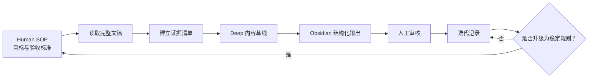

# Obsidian Transcript Workflow

一个可以通过 Codex Plugin 一次安装的博客/播客全文稿转写工作流。

Plugin 同时包含：

- `podcast-bridge`：读取完整 DOCX/Markdown/TXT 文稿，生成高质量 Obsidian 中文深度笔记；
- `mermaid-visualizer`：在内容确实存在流程、层级、决策或因果系统时，生成兼容 Obsidian/GitHub 的 Mermaid 图。

它不是一条 Mega Prompt，而是由 Human SOP、Agent Skill、可执行 Workflow 和迭代反馈共同组成。

## 一次安装

让 Codex 执行下面两条命令：

```powershell
codex plugin marketplace add qinjiu001/obsidian-transcript-workflow
codex plugin add obsidian-transcript-workflow@qinjiu001-skills
```

安装完成后新建一个 Codex 任务，让 Codex 重新加载两个 Skill。

你也可以把下面这段话直接发给 Codex：

```text
请安装这个 Codex Plugin：
https://github.com/qinjiu001/obsidian-transcript-workflow

先把该 GitHub 仓库添加为 Plugin Marketplace，
再安装 obsidian-transcript-workflow@qinjiu001-skills。
安装后检查 podcast-bridge 和 mermaid-visualizer 是否同时可用。
```

## 首次配置本地文稿

首次使用本地 DOCX 队列时，对 Codex 说：

```text
初始化 Obsidian Transcript Workflow 的本地文稿路径配置。
```

`podcast-bridge` 会创建：

```text
~/.codex/obsidian-transcript-workflow/library-workflow.json
```

然后填写自己的：

- `source_root`：原始 DOCX 根目录；
- `target_root`：Obsidian 的 `raw/02-papers` 目录；
- `human_sop`：当前 Human SOP；
- `iteration_log`：迭代记录；
- `workbuddy_handoff`：跨 Agent 交接文档。

个人配置保存在用户目录，不会写进 Plugin 或公开仓库。

## 使用示例

```text
按我的 Human SOP，把这份 DOCX 处理成 Obsidian 中文深度笔记。
保持源目录分类，输出到 raw/02-papers。
完成后把执行反馈写回迭代记录。
```

对于已经存在完整 DOCX/Markdown/TXT 文稿的任务，不会重新执行音频转录。

## 工作流



## 仓库结构

```text
obsidian-transcript-workflow/
├── .agents/plugins/marketplace.json
├── plugins/
│   └── obsidian-transcript-workflow/
│       ├── .codex-plugin/plugin.json
│       ├── README.md
│       ├── LICENSE
│       ├── docs/
│       │   ├── Human_SOP_标准化模板.md
│       │   ├── 迭代记录.md
│       │   └── WorkBuddy_播客文稿处理交接文档.md
│       └── skills/
│           ├── podcast-bridge/
│           │   ├── SKILL.md
│           │   ├── ARCHITECTURE.md
│           │   ├── references/
│           │   └── scripts/
│           └── mermaid-visualizer/
│               ├── SKILL.md
│               ├── LICENSE
│               └── references/
└── README.md
```

## 迭代原则

- Human SOP 保存已经经过人工确认的目标和质量标准。
- 迭代记录可以保留尚未验证的问题和观察。
- Agent 每次执行后记录修改、验证结果、临时假设和人工确认项。
- 未经人工确认的观察，不直接升级为 Skill 的稳定规则。
- Mermaid 默认最多一张；不能提升理解时不生成。
- 默认输出 Obsidian 原生 Markdown，不生成 HTML 或额外 CSS 美化。

## 隐私边界

公开仓库不会提交：

- API Key、Token 和 `.env`；
- `subscriptions.json` 个人订阅；
- `podcast_library/` 数据库和转写成品；
- `library-workflow.json` 个人绝对路径；
- 音频、缓存和构建产物。

## 来源与许可

- Podcast Bridge 基于 [Hatari130/podcast-bridge](https://github.com/Hatari130/podcast-bridge) 继续定制，MIT License。
- Mermaid Visualizer 来自 [axtonliu/axton-obsidian-visual-skills](https://github.com/axtonliu/axton-obsidian-visual-skills)，MIT License。
